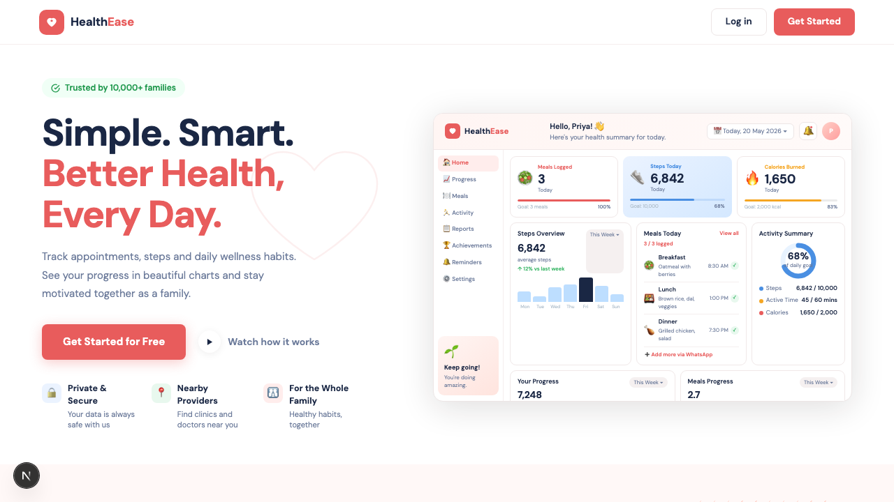
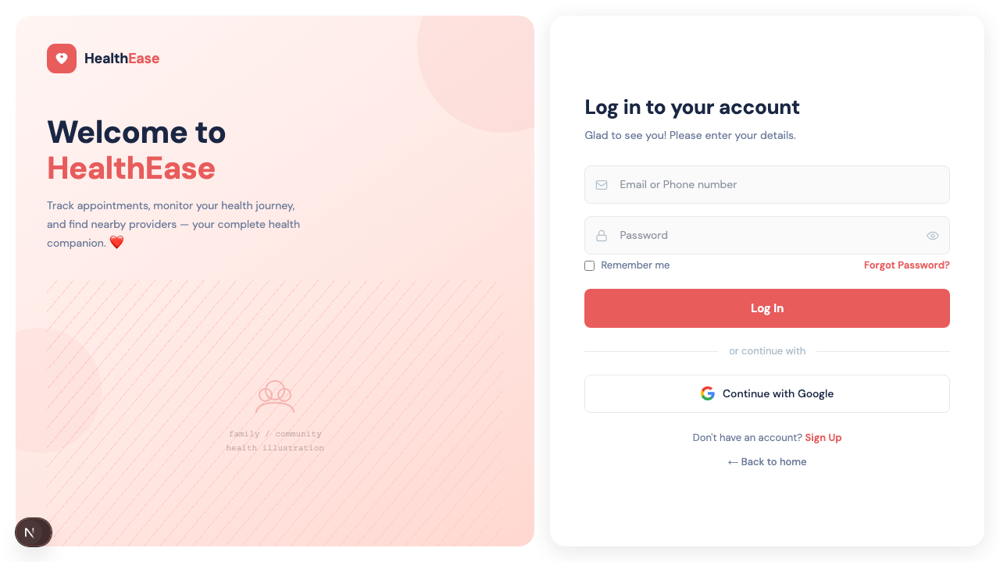
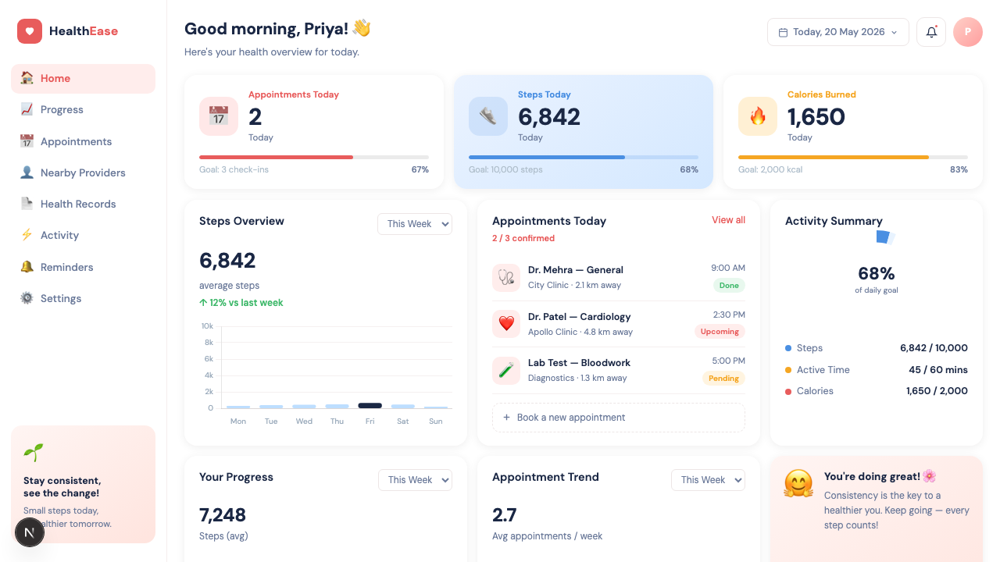

# HealthEase

**Simple. Smart. Better Health, Every Day.**

A modern personal health companion that helps individuals and families track appointments, monitor daily wellness habits, and visualise progress — all in one beautifully designed dashboard.

---

## About

HealthEase is a frontend web application designed around the needs of health-conscious families. It provides an intuitive interface for logging meals, tracking steps, managing medical appointments, and celebrating wellness milestones.

Key highlights:

- **Personalised dashboard** — at-a-glance stats for steps, calories, and appointments with real-time chart visualisations
- **Nearby providers** — surface clinics and doctors in your area directly from the app
- **Family-first design** — built to be shared and understood by the whole household
- **Private & secure** — your health data stays yours; no third-party sharing

> Trusted by 10,000+ families

---

## Screenshots

### Landing Page

### Login

### Dashboard

